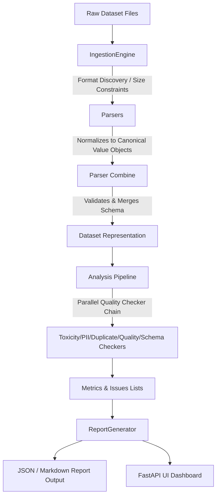

# LLM Training Data Quality Analyzer

[](https://www.python.org/)
[](LICENSE)
[](#tests)

An enterprise-grade, extensible data quality inspection engine designed specifically for large language model (LLM) training datasets. The analyzer discovers duplicates, PII leaks, toxic spans, low-signal entries, and schema violations, producing auditable reports for high-fidelity dataset curation.

---

## 📖 Table of Contents
* [Overview](#overview)
* [Key Features](#key-features)
* [Architecture & Data Flow](#architecture--data-flow)
* [Project Structure](#project-structure)
* [Tech Stack](#tech-stack)
* [Installation & Setup](#installation--setup)
* [Quickstart & API Usage](#quickstart--api-usage)
* [Interactive Web Dashboard](#interactive-web-dashboard)
* [Configuration Reference](#configuration-reference)
* [Tests](#tests)
* [License](#license)

---

## 🔍 Overview

Machine learning models are only as good as their training data. Poisoned inputs—such as leaked PII, near-duplicate spam, toxic language, and malformed rows—significantly degrade model behavior and safety. 

This repository implements a modular, high-throughput inspection engine built with strict typing and property-based test verification. It ingests large multi-format datasets, applies configured checkers, redacts sensitive info, computes dataset-wide quality metrics, and outputs comprehensive, pipeline-friendly reports in JSON and Markdown.

---

## ✨ Key Features

* **Multi-Format Ingestion Engine**: Seamlessly processes JSON, JSONL, CSV, and Parquet formats under custom file-size constraints.
* **Granular Quality Detectors**:
  * **Duplicate & Near-Duplicate Matching**: Uses token-level Jaccard similarity/n-gram indexing with configurable similarity thresholds.
  * **PII Detection & Redaction**: Flags and replaces sensitive information (emails, phone numbers, and SSNs) returning redacted variants of records.
  * **Toxicity Scoring**: Computes offensive-language content scores based on customized lexicon mappings and character spans.
  * **Quality Metrics**: Checks for empty records, token length limits, and gibberish (high character-entropy/special characters).
  * **Format & Schema Validation**: Enforces custom schemas or infers baseline structures directly from data records.
* **FastAPI Web Dashboard**: Includes a responsive interface to upload files, adjust parameters dynamically, and review records and issues in real-time.
* **Auditable Output Formats**: Emits standardized, machine-readable JSON payloads and human-readable Markdown files.

---

## 🏗️ Architecture & Data Flow

Below is the conceptual flow of a dataset during analysis:



All parsers normalize incoming fields into a unified `Value` type (`Union[str, int, float, bool, None, list, dict]`), preserving strict type boundaries to prevent silent coercion (e.g. maintaining differentiation between `True` and `1`).

---

## 📁 Project Structure

```
LLM-Training-Data-Quality-Analyzer/
├── pyproject.toml              # Project metadata & build dependencies
├── LICENSE                     # MIT License
├── CONTRIBUTING.md             # Developer contribution guidelines
├── run_ui.py                   # FastAPI Dev Server launcher
├── samples/                    # Example dataset files (CSV, JSON, JSONL)
│   ├── sample_dataset.csv
│   ├── sample_dataset.json
│   └── sample_dataset.jsonl
├── analyzer/                   # Core Python Package
│   ├── __init__.py             # Public module interface exports
│   ├── models.py               # Value objects, Datasets, Metrics, and Issues
│   ├── errors.py               # Custom Domain Exceptions
│   ├── ingestion.py            # File ingestion engine & size validator
│   ├── parsers.py              # Extensible JSON/JSONL/CSV/Parquet parsers
│   ├── combine.py              # Parsing integrator & schema merger
│   ├── pipeline.py             # Analysis coordinator
│   ├── metrics.py              # Quantitative dataset metrics calculations
│   ├── report.py               # JSON & Markdown report builders
│   ├── pretty_printer.py       # Console stdout formatter
│   ├── server.py               # FastAPI web endpoints
│   ├── static/                 # Web UI Assets
│   │   ├── index.html          # Interactive UI layout
│   │   ├── styles.css          # Design system & responsive layout
│   │   └── app.js              # State management & chart visualization
│   └── detectors/              # Quality Inspector Modules
│       ├── __init__.py
│       ├── duplicate.py        # Token-based Jaccard similarity
│       ├── pii.py              # Regex PII identification & redaction
│       ├── toxicity.py         # Toxicity scoring and substring mapping
│       ├── quality.py          # Short record & gibberish indicators
│       └── format_validator.py # Strict schema validation & type assertions
└── tests/                      # Suite of 400 Unit & Hypothesis Tests
```

---

## 🛠️ Tech Stack

* **Core Engine**: Python `>=3.11`
* **Parsing Utilities**: `PyArrow`, `setuptools`
* **Web Server Framework**: `FastAPI`, `Uvicorn`, `Starlette`, `python-multipart`
* **Testing Infrastructure**: `pytest`, `Hypothesis` (for property-based execution testing)
* **Frontend Design**: Vanilla CSS (CSS Grid, Flexbox), JavaScript (Fetch API, Chart.js)

---

## 🚀 Installation & Setup

1. **Clone the Repository**:
   ```bash
   git clone https://github.com/theBrainly/LLM-Training-Data-Quality-Analyzer.git
   cd LLM-Training-Data-Quality-Analyzer
   ```

2. **Set up Virtual Environment**:
   ```bash
   python3 -m venv .venv
   source .venv/bin/activate
   ```

3. **Install Dependencies**:
   ```bash
   pip install --upgrade pip
   pip install -e ".[dev,ui]"
   ```

---

## 💻 Quickstart & API Usage

### Running Quality Analysis Programmatically

```python
from analyzer import IngestionEngine, IngestionConfig
from analyzer.parsers import Parser
from analyzer.combine import combine
from analyzer.pipeline import analyze, PipelineConfig
from analyzer.report import ReportGenerator, OutputFormat

# 1. Ingest dataset file
engine = IngestionEngine()
result = engine.ingest("samples/sample_dataset.jsonl", IngestionConfig())

# 2. Parse and combine records into unified Dataset
parser = Parser()
combined = combine(result, parser)

# 3. Execute analysis pipeline
config = PipelineConfig(similarity_threshold=0.85)
analysis = analyze(combined.dataset, config=config, parse_issues=combined.issues)

# 4. Generate & serialize structured report
generator = ReportGenerator()
report = generator.build(combined.dataset, analysis.metrics, analysis.issues)

# Serialize to Markdown for human audits
md_report = generator.serialize(report, OutputFormat.MARKDOWN)
print(md_report.text)
```

---

## 🖥️ Interactive Web Dashboard

Launch the FastAPI web server to inspect your datasets interactively:

```bash
python run_ui.py
```

Open your browser and navigate to **[http://127.0.0.1:8000/](http://127.0.0.1:8000/)**.

### Features:
* **Interactive Threshold Adjusters**: Slide and modify similarity limits, minimum token length, and gibberish ratios.
* **Real-time Metrics Panel**: View total issue count, average token density, and overall data quality score.
* **Detailed Record Inspector**: Highlights exactly which records contained failures, the location coordinates, and redacted forms of text if PII was detected.
* **Live Exporters**: Download the final audit reports in Markdown or JSON instantly.

---

## ⚙️ Configuration Reference

Inspect the pipeline configuration variables:

| Configuration Parameter | Default Value | Description |
| :--- | :--- | :--- |
| `similarity_threshold` | `0.9` | Minimum Jaccard token similarity to flag records as near-duplicates. |
| `toxicity_threshold` | `0.8` | Toxicity rating above which a record is flagged. |
| `min_token_threshold` | `3` | Minimum words/tokens. Shorter texts flag a `LOW_QUALITY_SHORT` issue. |
| `gibberish_threshold` | `0.5` | Ratio of special/non-alphabetic characters to overall text to trigger quality flags. |

### Designing Custom Validation Schemas

Enforce strict formatting schemas:

```python
from analyzer.models import Schema, FieldSpec, FieldType

custom_schema = Schema(fields=[
    FieldSpec(name="instruction", type=FieldType.STRING, required=True),
    FieldSpec(name="response", type=FieldType.STRING, required=True),
    FieldSpec(name="rating", type=FieldType.INTEGER, required=False)
])
```

---

## 🧪 Tests

Correctness is verified with **400 unit and property-based test cases** powered by `pytest` and `Hypothesis`. The test suite targets edge cases in file parsing, extreme inputs, duplicate detections, and schema mappings.

To run tests:
```bash
pytest
```

---

## 📄 License

This project is licensed under the MIT License. See [LICENSE](LICENSE) for details.
